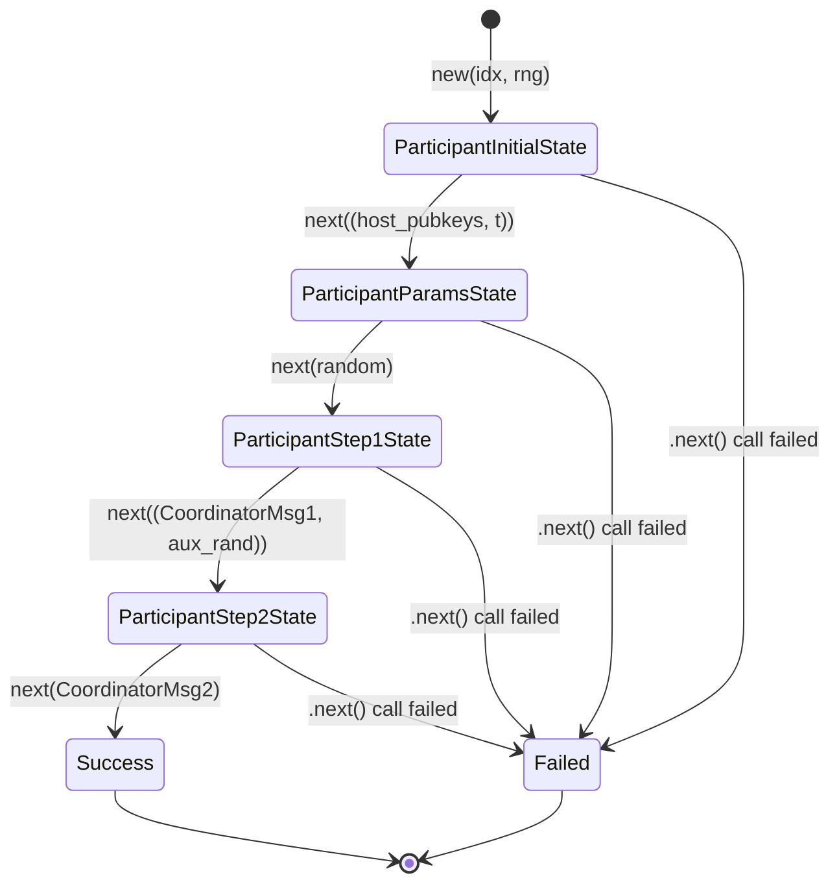
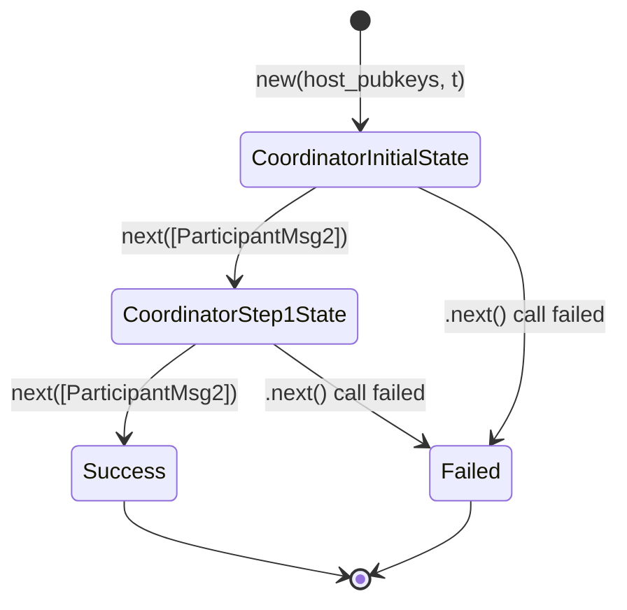

# ChillDKG

[](https://opensource.org/licenses/MIT)
[](https://github.com/olegfomenko/chilldkg/issues)
<a href="https://github.com/olegfomenko/chilldkg">

</a>

⚠️ __Please note - this crypto library has not been audited, so use it at your own risk.__

---

Experimental Rust implementation of the ChillDKG refers to the
[BlockstreamResearch BIP-FROST-DKG](https://github.com/BlockstreamResearch/bip-frost-dkg).

The crate is built around `k256` secp256k1 scalars and curve points. It exposes
typed participant and coordinator state machines, plus the lower-level crypto
building blocks used by the protocol.

⚠️ This repository is a work in progress.

- [x] The main participant and coordinator DKG flows.
- [x] Tests with reference test vectors (`tests/vectors`).
- [ ] Recovery using transcript and secret host key.
- [ ] Malicious behavior investigation.
- [ ] Messages serialization.
- [ ] Implementation audit.

## Implementation

- `src/party`: participant state machine.
- `src/coordinator`: coordinator state machine.
- `src/msg.rs`: typed protocol messages and recovery data.
- `src/errors.rs`: ChillDKG-style error names.
- `src/math`: scalar polynomial helpers.
- `src/crypto`: tagged hashing, point helpers, encryption pads, proof of possession, and CertEq helpers.
- `tests`: unit tests and reference-vector integration tests.

The API models the protocol as consuming state transitions. Each call to `next`
takes the input for the current step, returns the next state, and returns the
message or output produced by that step.

High-level flow:

1. Each participant creates `ParticipantInitialState`.
2. The coordinator creates `CoordinatorInitialState` from all host public keys
   and threshold `t`.
3. Participants accept the session parameters and produce `ParticipantMsg1`.
4. The coordinator aggregates all `ParticipantMsg1` values into `CoordinatorMsg1`.
5. Participants process `CoordinatorMsg1` and produce `ParticipantMsg2`.
6. The coordinator verifies all `ParticipantMsg2` values and produces
   `CoordinatorMsg2`, coordinator DKG output, and recovery data.
7. Participants verify `CoordinatorMsg2` and produce their final DKG outputs.

### Participant States



### Coordinator States



All transitions return `anyhow::Result`. Validation or protocol failures return
an error instead of advancing to the next state.

## Example

```rust
use chilldkg::coordinator::{CoordinatorInitialState, CoordinatorState};
use chilldkg::msg::{ParticipantMsg1, ParticipantMsg2};
use chilldkg::party::{
    ParticipantInitialState, ParticipantParamsState, ParticipantState, ParticipantStep1State,
    ParticipantStep2State,
};
use k256::ProjectivePoint;
use rand_core::OsRng;

fn main() -> anyhow::Result<()> {
    const N: usize = 5;
    const T: usize = 3;

    let mut rng = OsRng;

    let participants: Vec<_> = (0..N)
        .map(|idx| ParticipantInitialState::new(idx, &mut rng))
        .collect();

    let host_pubkeys: Vec<ProjectivePoint> =
        participants.iter().map(|p| p.get_host_key()).collect();

    let coordinator = CoordinatorInitialState::new(host_pubkeys.clone(), T)?;

    let participants: Vec<ParticipantParamsState> = participants
        .into_iter()
        .map(|p| p.next((host_pubkeys.clone(), T)).map(|(next, _)| next.unwrap()))
        .collect::<anyhow::Result<_>>()?;

    let mut pmsg1s: Vec<ParticipantMsg1> = Vec::with_capacity(N);
    let participants: Vec<ParticipantStep1State> = participants
        .into_iter()
        .map(|p| {
            let random = [0u8; 32];
            let (next, msg) = p.next(random)?;
            pmsg1s.push(msg);
            Ok(next.unwrap())
        })
        .collect::<anyhow::Result<_>>()?;

    let (coordinator, cmsg1) = coordinator.next(pmsg1s)?;
    let coordinator = coordinator.unwrap();

    let mut pmsg2s: Vec<ParticipantMsg2> = Vec::with_capacity(N);
    let participants: Vec<ParticipantStep2State> = participants
        .into_iter()
        .map(|p| {
            let aux_rand = [1u8; 32];
            let (next, msg) = p.next((cmsg1.clone(), aux_rand))?;
            pmsg2s.push(msg);
            Ok(next.unwrap())
        })
        .collect::<anyhow::Result<_>>()?;

    let (_, (cmsg2, coordinator_output, recovery_data)) = coordinator.next(pmsg2s)?;

    for participant in participants {
        let (_, (participant_output, participant_recovery_data)) =
            participant.next(cmsg2.clone())?;

        assert_eq!(
            participant_output.threshold_pubkey,
            coordinator_output.threshold_pubkey
        );
        assert_eq!(participant_output.pubshares, coordinator_output.pubshares);
        assert_eq!(participant_recovery_data, recovery_data);
    }

    Ok(())
}
```

In real use, `random` and `aux_rand` must be fresh 32-byte randomness values.
The all-zero arrays above are only to keep the example short.

## Tests

Run all tests:

```bash
cargo test
```

The current integration vector suites include:

- `participant_step1_vectors`
- `participant_step2_vectors`
- `participant_finalize_vectors`
- `coordinator_step1_vectors`
- `coordinator_finalize_vectors`

The vector files live in `tests/vectors` and are derived from the Python
reference implementation. Some reference tests that validate raw byte decoding
are intentionally not represented yet because this crate currently exposes typed
Rust messages rather than byte-level parsing APIs.

## Development Notes

- Uppercase local variable names such as `P_i` and `C_k` denote curve points.
- Lowercase scalar names such as `s`, `r`, and `tweak` denote scalars or ordinary values.
- The implementation deliberately avoids custom serializers for `k256` types for now.
- Keep reference-vector tests focused on behavior that can reach the typed Rust API.
