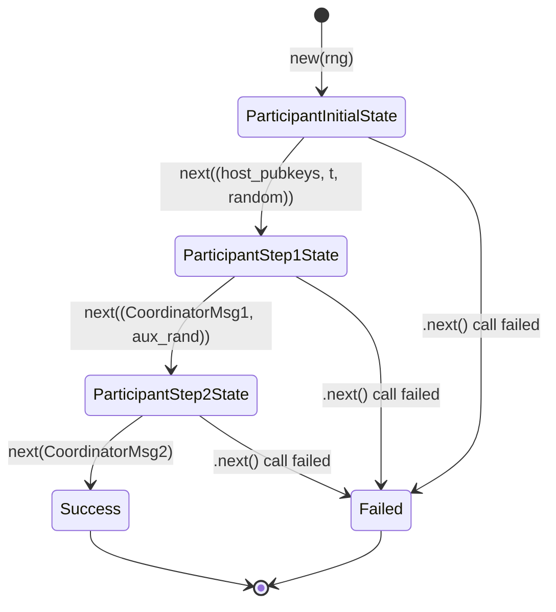
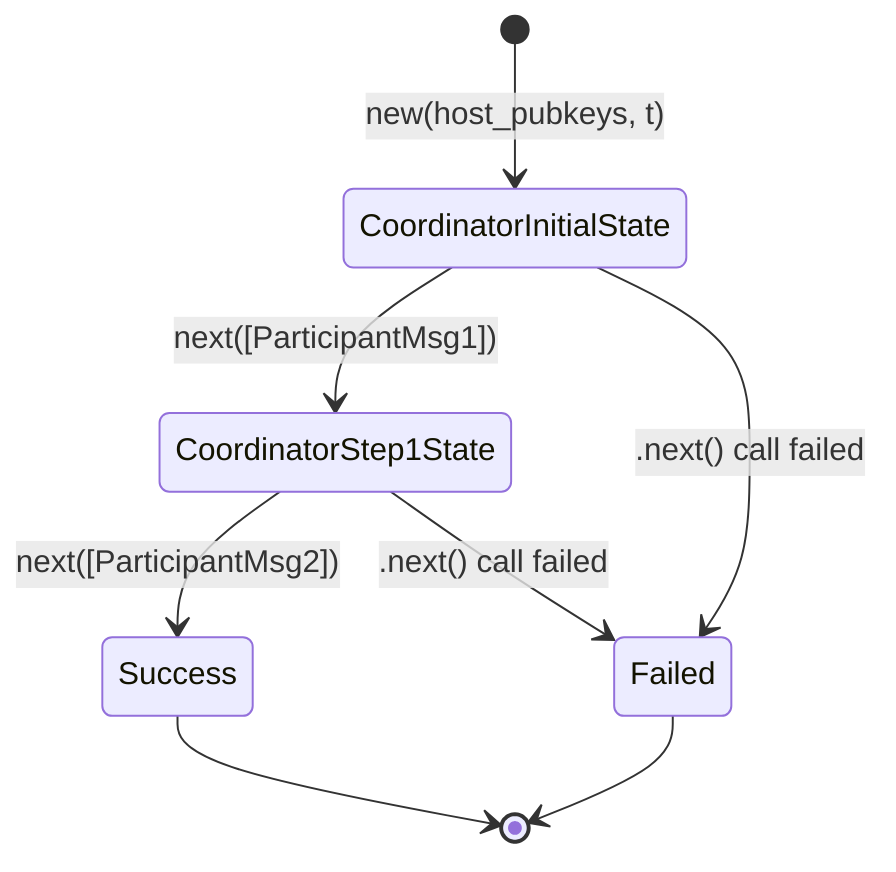

# ChillDKG

[](https://opensource.org/licenses/MIT)
[](https://github.com/olegfomenko/chilldkg/issues)
<a href="https://github.com/olegfomenko/chilldkg">

</a>

⚠️ __Please note - this crypto library has not been audited, so use it at your own risk.__

---

Experimental Rust implementation of the ChillDKG refers to the
[BlockstreamResearch BIP-FROST-DKG](https://github.com/BlockstreamResearch/bip-frost-dkg).

The crate is built around `k256` secp256k1 scalars and curve points. It exposes
typed participant and coordinator state machines, plus the lower-level crypto
building blocks used by the protocol.

⚠️ This repository is a work in progress.

- [x] The main participant and coordinator DKG flows.
- [x] Tests with reference test vectors.
- [x] Participant recovery using transcript and secret host key.
- [x] Coordinator recovery using transcript.
- [ ] Malicious behavior investigation.
- [ ] Messages serialization.
- [ ] Implementation audit.

## Implementation

- `src/party`: participant state machine.
- `src/coordinator`: coordinator state machine.
- `src/msg.rs`: typed protocol messages and recovery data.
- `src/errors.rs`: ChillDKG-style error names.
- `src/crypto`: tagged hashing, point helpers, encryption pads, proof of possession, and CertEq helpers.
- `tests`: unit tests and reference-vector integration tests.

The API models the protocol as consuming state transitions. Each call to `next`
takes the input for the current step, returns the next state, and returns the
message or output produced by that step.

High-level flow:

1. Each participant creates `ParticipantInitialState`.
2. The coordinator creates `CoordinatorInitialState` from all host public keys
   and threshold `t`.
3. Participants accept the coordinator-provided session parameters plus local
   randomness and produce `ParticipantMsg1`.
4. The coordinator aggregates all `ParticipantMsg1` values into `CoordinatorMsg1`.
5. Participants process `CoordinatorMsg1` and produce `ParticipantMsg2`.
6. The coordinator verifies all `ParticipantMsg2` values and produces
   `CoordinatorMsg2`, coordinator DKG output, and recovery data.
7. Participants verify `CoordinatorMsg2` and produce their final DKG outputs.

### Participant States

Each state transition for participant is implemented via

```rust
pub trait ParticipantState: Sized {
    type Message;
    type Next: ParticipantState;
    type Output;

    fn next(self, msg: Self::Message) -> Result<(Option<Self::Next>, Self::Output)>;
}
```


```mermaid
stateDiagram-v2
    [*] --> ParticipantInitialState: new(rng)
    ParticipantInitialState --> ParticipantStep1State: next((host_pubkeys, t, random))
    ParticipantInitialState --> Failed: .next() call failed
    ParticipantStep1State --> ParticipantStep2State: next((CoordinatorMsg1, aux_rand))
    ParticipantStep1State --> Failed: .next() call failed
    ParticipantStep2State --> Success: next(CoordinatorMsg2)
    ParticipantStep2State --> Failed: .next() call failed
    Success --> [*]
    Failed --> [*]
```

All transitions return `std::result::Result<T, ChillDkgError>`. Validation or protocol failures return
an error instead of advancing to the next state.

### Coordinator States

Each state transition for coordinator is implemented via

```rust
pub trait CoordinatorState: Sized {
    type Message;
    type Next: CoordinatorState;
    type Output;

    fn next(self, msg: Self::Message) -> Result<(Option<Self::Next>, Self::Output)>;
}
```


```mermaid
stateDiagram-v2
    [*] --> CoordinatorInitialState: new(host_pubkeys, t)
    CoordinatorInitialState --> CoordinatorStep1State: next([ParticipantMsg1])
    CoordinatorInitialState --> Failed: .next() call failed
    CoordinatorStep1State --> Success: next([ParticipantMsg2])
    CoordinatorStep1State --> Failed: .next() call failed
    Success --> [*]
    Failed --> [*]
```

All transitions return `std::result::Result<T, ChillDkgError>`. Validation or protocol failures return
an error instead of advancing to the next state.

## Example

All messages are defined in `chilldkg_rs::msg::`. The outputs are
`chilldkg_rs::msg::CoordinatorDKGOutput` and `chilldkg_rs::msg::DKGOutput`. The recovery data is
`chilldkg_rs::msg::RecoveryData`.

### State-machine level

The low-level state machine is exposed and can be used as well. Check tests in [lib.rs](./src/lib.rs).
You may need the following imports:

```rust
use chilldkg_rs::coordinator::{CoordinatorInitialState, CoordinatorState};
use chilldkg_rs::msg::*;
use chilldkg_rs::party::{
    ParticipantInitialState, ParticipantState, ParticipantStep1State, ParticipantStep2State,
};
```

Example for Participant:

```rust
const N: usize = 5;
const T: usize = 3;

let mut rng = OsRng;

// 1. Prepare params 
let party = ParticipantInitialState::new(&mut rng);
// TODO: securely save p.s

// 2. Execute step #1

let random = [0u8; 32]; // TODO: generate good randomness 
let (next, msg1) = party.next((host_pubkeys, T, random))?;
let party = next.unwrap();

// TODO: Share msg1 with Coordinator, receive cmsg1

// 3. Execute step #2

let aux = [0u8; 32];
let (next, msg2) = party.next((cmsg1, aux))?;
let party = next.unwrap();

// TODO: Share msg2 with Coordinator, receive cmsg2

// 4. Execute final check

let (_, (participant_output, participant_recovery_data)) = party.next(cmsg2)?;

// TODO: save somewhere participant_recovery_data and securely store private share in participant_output
```

In real use, `random` and `aux_rand` must be fresh 32-byte randomness values.
The all-zero arrays above are only to keep the example short.

Example for Coordinator:

```rust
const N: usize = 5;
const T: usize = 3;

// 1. Prepare params 
let coordinator = CoordinatorInitialState::new(host_pubkeys.clone(), T)?;

// TODO: collect pmsg1 from participants
// 2. Execute step #1
let (next, cmsg1) = coordinator.next(pmsg1s)?;
let coordinator = next.unwrap();

// TODO: share cmsg1 with all participants, collect pmsg2 from participants

// 3. Execute step #2

// Coordinator obtains DKG output immediately. 
// However, we should wait upon successful execution of the last message by each participant.
let (_, (cmsg2, coordinator_output, recovery_data)) = coordinator.next(pmsg2s)?;
// TODO: share cmsg2 with all participants
```

### Crate-level

For engineers convenience we also introduce high-level SDK over state-machine. You may need the following imports:

```rust
use chilldkg_rs::{Coordinator, Participant};
```

Then, the code for participant is:

```rust
const N: usize = 5;
const T: usize = 3;

let (host_seckey, mut party) = Participant::new(&mut rng);
// TODO: Securely save host_seckey

let random = [0u8; 32]; // TODO: generate good randomness
let msg1 = party.step1((host_keys, T, random))?;
// TODO: send msg1, receive msg1_resp from coordinator

let aux = [0u8; 32]; // TODO: generate good randomness
let msg2 = party.step2((msg1_resp, aux))?;
// TODO: send msg2, receive msg2_resp from coordinator

let (output, recovery) = party.finalize(msg2_resp)?;
// Output contains your secure share, while recover contains public transcript and signatures
// TODO: save somewhere recovery and securely store private share in output
```

The core for coordinator is as follows:

```rust
const N: usize = 5;
const T: usize = 3;

let mut coordinator = Coordinator::new(host_keys, T)?;

// TODO: receive messages from participants and put into the msg1 list
let msg1_resp = coordinator.step1(msg1)?;
// TODO: share msg1_resp with all participants

// TODO: receive messages from participants and put into the msg2 list
// Coordinator obtains DKG output immediately. 
// However, we should wait upon successful execution of the last message by each participant.
let (msg2_resp, output, _) = coordinator.step2(msg2)?;
// TODO: send msg2_resp to all participants
```

To recover DKG results on the participants side, you have to provide participant's host secret key and recovery data as
follows:

```rust
use chilldkg_rs::{Coordinator, Participant};

let p_output_recovered = Participant::recover(&host_seckey, &recovery_data)?; // For participant

let c_output_recovered = Coordinator::recover(&recovery_data)?; // For coordinator
```

## Tests

Run all tests:

```bash
cargo test
```

Current vector coverage:

- `participant_step1_vectors`: reference cases `1, 3, 5, 6`.
- `participant_step2_vectors`: reference cases `1, 3, 4, 5, 6, 7`.
- `participant_finalize_vectors`: reference cases `1, 2, 3`.
- `coordinator_step1_vectors`: reference cases `1, 2, 4, 5`.
- `coordinator_finalize_vectors`: reference cases `1, 2, 3`.
- `recover_vectors`: reference cases `1, 2, 3, 4, 5, 6, 7, 8, 9, 11`.

## Differences From The Reference Implementation

This crate follows the protocol logic of the Python reference implementation in
the core successful participant and coordinator DKG flow: VSS coefficient
derivation, EncPedPop encryption pads, PoP verification, CertEq signatures,
Taproot tweaking, public share calculation, and final certificate verification
are intended to match the reference and are checked with reference vectors.

The remaining differences are API, serialization, recovery, and fault-handling
differences:

- The reference public API is byte-oriented, while ours is currently datastructs-oriented.
- The reference messages serialize some group elements with an explicit
  point-at-infinity encoding. This crate currently avoids custom serializers and
  mostly works with typed points plus ordinary compressed SEC1 encoding.
- The reference includes optional malicious-behavior investigation
  (`participant_investigate` and `coordinator_investigate`) for invalid encrypted
  shares. This crate raises the corresponding unknown-fault error during
  participant step 2, but does not carry the investigation data or implement the
  investigation protocol.
- Recovery is split into participant and coordinator APIs in this crate.
- Reference-vector files are adapted only where needed to reach the typed Rust
  API.
- Recovery validation order is not identical. This affects error classification
  for malformed recovery data but not the DKG output accepted on a successful
  recovery.
- Recovery transcript parsing is stricter for public nonces. This may change
  which error is returned for malformed recovery bytes.

## Development Notes

- Uppercase local variable names such as `P_i` and `C_k` denote curve points.
- Lowercase scalar names such as `s`, `r`, and `tweak` denote scalars or ordinary values.
- The implementation deliberately avoids custom serializers for `k256` types for now.
