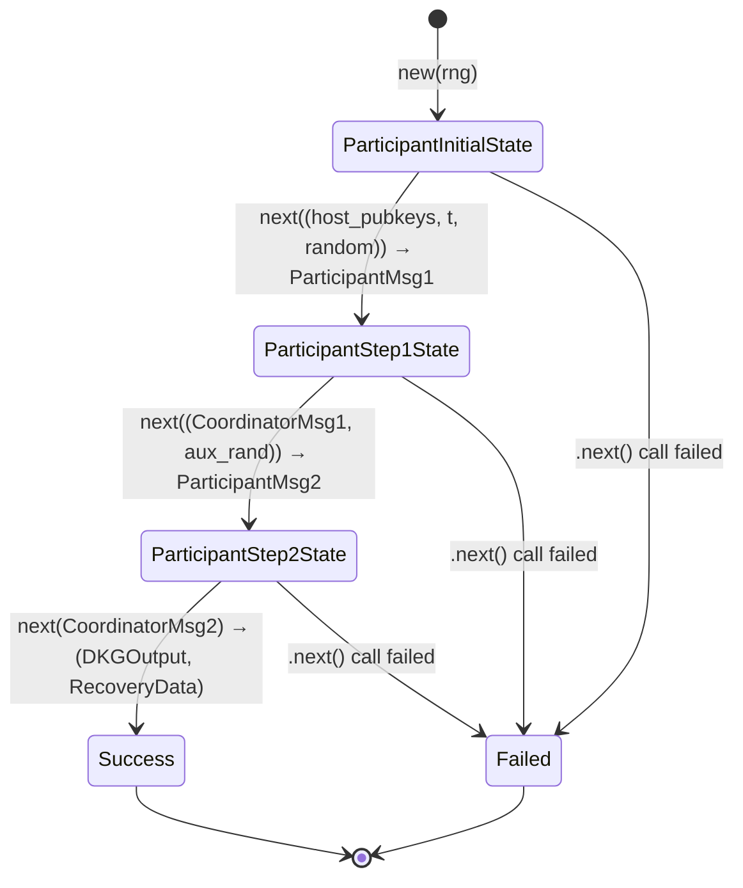
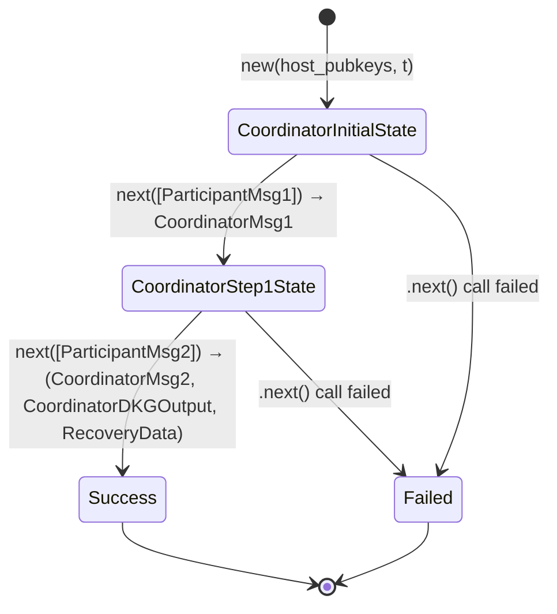
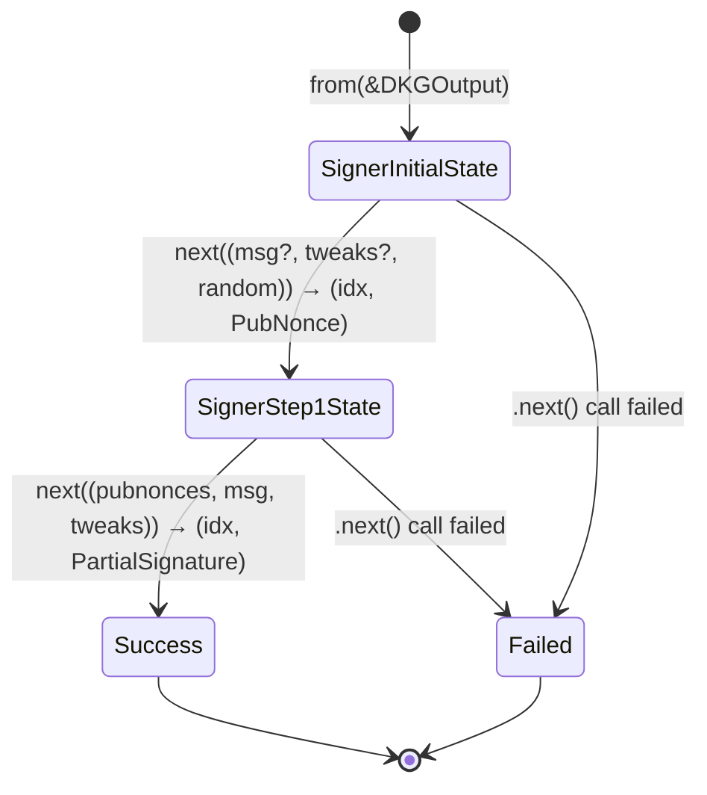
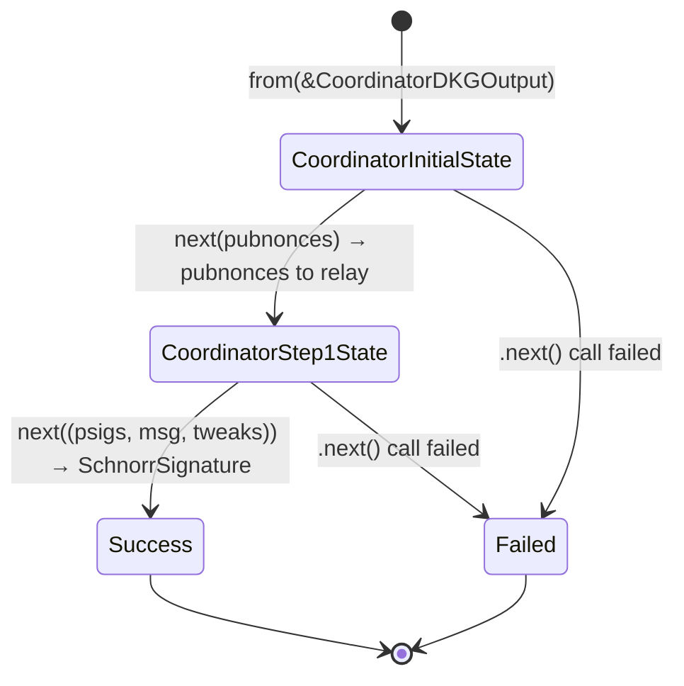

# ChillDKG

[](https://opensource.org/licenses/MIT)
[](https://github.com/olegfomenko/chilldkg/issues)
<a href="https://github.com/olegfomenko/chilldkg">

</a>

⚠️ __Please note - this crypto library has not been audited, so use it at your own risk.__

---

Experimental Rust implementation of the ChillDKG refers to the
[BlockstreamResearch BIP-FROST-DKG](https://github.com/BlockstreamResearch/bip-frost-dkg).

The crate is built around `k256` secp256k1 scalars and curve points. It exposes
typed participant and coordinator state machines, plus the lower-level crypto
building blocks used by the protocol.

⚠️ This repository is a work in progress.

- [x] The main participant and coordinator DKG flows.
- [x] Tests with reference test vectors.
- [x] Participant recovery using transcript and secret host key.
- [x] Coordinator recovery using transcript.
- [x] FROST signing ([BIP-FROST-signing](https://github.com/siv2r/bip-frost-signing), behind the `signing` feature).
- [ ] Deterministic FROST signing.
- [ ] Malicious behavior investigation.
- [ ] Messages serialization.
- [ ] Implementation audit.

## Packages

- `src/dkg`: ChillDKG, with the high-level SDK (`Participant`, `Coordinator`) in `mod.rs`.
  - `src/dkg/party`: participant state machine and recovery.
  - `src/dkg/coordinator`: coordinator state machine and recovery.
  - `src/dkg/msg.rs`: typed protocol messages, DKG outputs and recovery data.
  - `src/dkg/errors.rs`: ChillDKG-style error names (`ChillDkgError`).
- `src/sign` (feature `signing`): FROST3 signing, laid out like `src/dkg`, with the high-level
  SDK (`Signer`, `Coordinator`) in `mod.rs`.
  - `src/sign/party`: signer state machine, nonce generation and partial signing.
  - `src/sign/coordinator`: coordinator state machine, verification and aggregation helpers.
  - `src/sign/msg.rs`: public nonces and partial signatures.
  - `src/sign/errors.rs`: `SignError`.
- `src/crypto`: tagged hashing, point helpers, BIP340 challenge, encryption pads, proof of
  possession, CertEq helpers, Lagrange interpolation and key tweaking (the last two behind
  `signing`). Reports through its own `CryptoError` (`src/crypto/errors.rs`), which `dkg` and
  `sign` convert into their protocol errors.
- `tests`: reference-vector integration tests; unit tests sit next to the code they cover.

## References

- DKG follows the [BlockstreamResearch BIP-FROST-DKG](https://github.com/BlockstreamResearch/bip-frost-dkg)
  Python reference implementation of ChillDKG and is checked against its test vectors.
- Signing follows the [BIP-FROST-signing](https://github.com/siv2r/bip-frost-signing) Python
  reference implementation (BIP445, FROST3 variant) and is checked against its test vectors.
  It lives behind the `signing` feature, which is enabled by default; opt out for a DKG-only
  build:

```toml
[dependencies]
chilldkg-rs = { version = "0.4", default-features = false }
```

See [Differences From The Reference Implementation](#differences-from-the-reference-implementation)
for what is intentionally not ported.

## DKG

ChillDKG produces a `t`-of-`n` threshold key: every participant ends up with a secret
share, the list of everyone's public shares and the threshold public key, and the
coordinator ends up with the public part of that plus recovery data. A session takes three
messaging rounds between the participants and the coordinator:

1. Every participant, knowing all host public keys and `t`, samples its VSS polynomial,
   encrypts a share for every other participant and sends `ParticipantMsg1`.
2. The coordinator aggregates the first-round messages into `CoordinatorMsg1` and
   broadcasts it. Every participant verifies the commitments and proofs of possession,
   decrypts its shares, derives its secret share and signs the session transcript,
   sending `ParticipantMsg2`.
3. The coordinator collects the transcript signatures into the certificate
   `CoordinatorMsg2`, obtains `CoordinatorDKGOutput` and `RecoveryData`, and broadcasts the
   certificate. Every participant verifies it and obtains its `DKGOutput` and the same
   `RecoveryData`.

A participant that missed the last round can later rebuild its `DKGOutput` from its host
secret key and the recovery data; the coordinator's output can be rebuilt from the recovery
data alone.

The crate exposes the protocol at two levels:

- **High-level SDK** (`Participant`, `Coordinator`): drivers that own the current state and
  are advanced in place with `step1`, `step2` and `finalize`. A step run twice or out of
  order returns an error, and any error moves the driver to a terminal failed state
  (`is_failed`, `failure`). This is the recommended entry point.
- **State machine** (`ParticipantInitialState` and friends): the consuming state
  transitions the SDK is built on. Each `next` call takes the input for the current step,
  returns the next state and the message produced by that step. Use it when you want to
  persist or inspect intermediate states yourself.

Both use the same messages from `chilldkg_rs::dkg::msg` and the same
`chilldkg_rs::dkg::ChillDkgError`.

### DKG Example

Imports:

```rust
use chilldkg_rs::dkg::Result;
use chilldkg_rs::dkg::{Coordinator, Participant};
```

Participant:

```rust
fn main() -> Result<()> {
    // ...

    const N: usize = 5;
    const T: usize = 3;

    // ...

    let (host_seckey, mut party) = Participant::new(&mut rng);
    // TODO: securely save host_seckey; it identifies you in every session and
    // is needed for recovery

    let random = [0u8; 32]; // TODO: generate good randomness
    let msg1 = party.step1((host_keys, T, random))?;
    // TODO: send msg1, receive msg1_resp from coordinator

    let aux = [0u8; 32]; // TODO: generate good randomness
    let msg2 = party.step2((msg1_resp, aux))?;
    // TODO: send msg2, receive msg2_resp from coordinator

    let (output, recovery) = party.finalize(msg2_resp)?;
    // output holds your secret share; recovery holds the public transcript and certificate
    // TODO: save recovery somewhere and securely store the secret share in output
}
```

In real use, `random` and `aux` must be fresh 32-byte randomness values. The all-zero
arrays above are only to keep the example short.

Coordinator:

```rust
fn main() -> Result<()> {
    // ...

    const N: usize = 5;
    const T: usize = 3;

    // ...

    let mut coordinator = Coordinator::new(host_keys, T)?;

    // TODO: receive messages from participants and put them into the msg1 list
    let msg1_resp = coordinator.step1(msg1)?;
    // TODO: share msg1_resp with all participants

    // TODO: receive messages from participants and put them into the msg2 list
    // The coordinator obtains the DKG output immediately. The session is only
    // complete once every participant has finalized successfully.
    let (msg2_resp, output, recovery) = coordinator.step2(msg2)?;
    // TODO: send msg2_resp to all participants
}
```

Recovery, on either side:

```rust
fn main() -> Result<()> {
    // ...

    // Participant's output, from its host secret key and the recovery data
    let p_output_recovered = Participant::recover(&host_seckey, &recovery_data)?;

    // Coordinator's output, from the recovery data alone
    let c_output_recovered = Coordinator::recover(&recovery_data)?;
}
```

### DKG State Machine

Every state implements one of the two traits below. `next` consumes the state, so a step
cannot be replayed; `Some(next)` is the state for the following round and `None` means the
session is over.

```rust
pub trait ParticipantState: Sized {
    type Message;
    type Next: ParticipantState;
    type Output;

    fn next(self, msg: Self::Message) -> Result<(Option<Self::Next>, Self::Output)>;
}

pub trait CoordinatorState: Sized {
    type Message;
    type Next: CoordinatorState;
    type Output;

    fn next(self, msg: Self::Message) -> Result<(Option<Self::Next>, Self::Output)>;
}
```

Participant:


```mermaid
stateDiagram-v2
    [*] --> ParticipantInitialState: new(rng)
    ParticipantInitialState --> ParticipantStep1State: next((host_pubkeys, t, random)) → ParticipantMsg1
    ParticipantInitialState --> Failed: .next() call failed
    ParticipantStep1State --> ParticipantStep2State: next((CoordinatorMsg1, aux_rand)) → ParticipantMsg2
    ParticipantStep1State --> Failed: .next() call failed
    ParticipantStep2State --> Success: next(CoordinatorMsg2) → (DKGOutput, RecoveryData)
    ParticipantStep2State --> Failed: .next() call failed
    Success --> [*]
    Failed --> [*]
```

Coordinator:


```mermaid
stateDiagram-v2
    [*] --> CoordinatorInitialState: new(host_pubkeys, t)
    CoordinatorInitialState --> CoordinatorStep1State: next([ParticipantMsg1]) → CoordinatorMsg1
    CoordinatorInitialState --> Failed: .next() call failed
    CoordinatorStep1State --> Success: next([ParticipantMsg2]) → (CoordinatorMsg2, CoordinatorDKGOutput, RecoveryData)
    CoordinatorStep1State --> Failed: .next() call failed
    Success --> [*]
    Failed --> [*]
```

All transitions return `std::result::Result<T, ChillDkgError>`. Validation or protocol
failures return an error instead of advancing to the next state; the consumed state is
gone, so the session has to be restarted from the initial state. States are plain structs
with public fields, so they can be inspected or persisted between rounds. A participant's
states hold its secret key material and are wiped on drop.

Imports:

```rust
use chilldkg_rs::dkg::msg::*;
use chilldkg_rs::dkg::{
    CoordinatorInitialState, CoordinatorState, ParticipantInitialState, ParticipantState,
    ParticipantStep1State, ParticipantStep2State, Result,
};
```

Participant:

```rust
fn main() -> Result<()> {
    // ...

    const N: usize = 5;
    const T: usize = 3;

    let mut rng = OsRng;

    // ...

    // 1. Prepare params
    let party = ParticipantInitialState::new(&mut rng);
    // TODO: securely save party.s, the host secret key

    // 2. Execute step #1
    let random = [0u8; 32]; // TODO: generate good randomness
    let (next, msg1) = party.next((host_pubkeys, T, random))?;
    let party = next.unwrap();
    // TODO: share msg1 with the coordinator, receive cmsg1

    // 3. Execute step #2
    let aux = [0u8; 32]; // TODO: generate good randomness
    let (next, msg2) = party.next((cmsg1, aux))?;
    let party = next.unwrap();
    // TODO: share msg2 with the coordinator, receive cmsg2

    // 4. Execute the final check
    let (_, (participant_output, participant_recovery_data)) = party.next(cmsg2)?;
    // TODO: save participant_recovery_data somewhere and securely store the
    // secret share in participant_output
}
```

Coordinator:

```rust
fn main() -> Result<()> {
    // ...

    const N: usize = 5;
    const T: usize = 3;

    // ...

    // 1. Prepare params
    let coordinator = CoordinatorInitialState::new(host_pubkeys.clone(), T)?;

    // 2. Execute step #1
    // TODO: collect pmsg1s from participants
    let (next, cmsg1) = coordinator.next(pmsg1s)?;
    let coordinator = next.unwrap();
    // TODO: share cmsg1 with all participants, collect pmsg2s from them

    // 3. Execute step #2
    // The coordinator obtains the DKG output immediately. The session is only
    // complete once every participant has finalized successfully.
    let (_, (cmsg2, coordinator_output, recovery_data)) = coordinator.next(pmsg2s)?;
    // TODO: share cmsg2 with all participants
}
```

The end-to-end test in [lib.rs](./src/lib.rs) runs a full `3`-of-`5` session with both APIs.

## Signing

FROST signing over a ChillDKG output: any `t` of the `n` participants produce a signature
that verifies as a plain BIP340 signature under the threshold public key. Participant ids
are the ChillDKG indices, and the subset that signs is simply the set of ids that
contribute a nonce. A session takes two messaging rounds:

1. Every signer derives a nonce pair from local randomness and sends the public half,
   paired with its id, to the coordinator. The coordinator validates the signing subset
   (at least `t` distinct ids in range whose public shares interpolate to the threshold
   key) and its nonces, then relays the `(id, PubNonce)` list to every signer.
2. Every signer takes that list, the message and the tweaks, and produces a partial
   signature. The coordinator verifies each partial signature against its signer's nonce
   and public share, combines them and checks the result under the tweaked threshold key.
   The output is a plain BIP340 `SchnorrSignature`.

Things every user should know:

- **Message and tweaks.** Every party must agree on the message and on the list of
  `Tweak`s applied to the threshold key (empty for a plain key). Both reach the
  coordinator only at round 2. A signer may give them at round 1 too, which binds the nonce
  to them so that round 2 refuses anything else, or pass `None` to generate the nonce
  before they are known.
- **Nonce reuse.** Reusing a secret nonce leaks the secret share. The nonce lives only in
  the signer's round-1 state, which is consumed by round 2 and wiped on drop, so it can be
  used once, for one session. A failed round 2 drops it as well; start a new session.

As for the DKG, the protocol is exposed at two levels:

- **High-level SDK** (`Signer`, `Coordinator`): drivers advanced in place. `Signer` runs
  `step1` (nonce) and `finalize` (partial signature); `Coordinator` runs `step1` (relay
  nonces) and `step2` (final signature). Steps run once, in order, and an error moves the
  driver to a terminal failed state (`is_failed`, `failure`).
- **State machine** (`SignerInitialState` and friends): the consuming transitions the SDK
  is built on, shaped exactly like the DKG ones.

Both use `PubNonce` and `PartialSignature` from `chilldkg_rs::sign::msg`, `Tweak` from
`chilldkg_rs::sign`, and `chilldkg_rs::sign::SignError`.

### Signing Example

Imports:

```rust
use chilldkg_rs::sign::Result;
use chilldkg_rs::sign::{Coordinator, Signer, Tweak};
```

Signer, holding the `DKGOutput` of the DKG session:

```rust
fn main() -> Result<()> {
    // ...

    // One driver per signing session, built from the DKG output.
    let mut signer = Signer::new(&output);

    // Round 1: the nonce. Pass Some(msg) / Some(tweaks) to bind the nonce to
    // them now, or None to generate it before they are known.
    let random = [0u8; 32]; // TODO: generate good randomness
    let pubnonce = signer.step1((Some(msg.to_vec()), Some(tweaks.clone()), random))?;
    // TODO: send pubnonce (already paired with this participant's id) to the coordinator

    // Round 2: the partial signature. Consumes the secret nonce.
    // TODO: receive the (id, pubnonce) list of all signers from the coordinator
    let psig = signer.finalize((pubnonces, msg.to_vec(), tweaks.clone()))?;
    // TODO: send psig (already paired with this participant's id) to the coordinator
}
```

Coordinator, holding the `CoordinatorDKGOutput` of the DKG session:

```rust
fn main() -> Result<()> {
    // ...

    let mut coordinator = Coordinator::new(&coordinator_output);

    // Round 1: validates the signing subset and its nonces before relaying.
    // TODO: select at least t signers and collect their (id, pubnonce)
    let relayed = coordinator.step1(pubnonces)?;
    // TODO: send relayed to every signer, collect their (id, psig)

    // Round 2: verifies every partial signature, combines them and checks the
    // result. A bad partial signature fails with
    // InvalidContribution { participant: id, .. }: exclude that signer and
    // start a new session.
    let sig = coordinator.step2((psigs, msg.to_vec(), tweaks.clone()))?;
}
```

Tweaks and verification. A session may sign under a tweaked key, e.g. a BIP32 child (plain
tweak) or a BIP341 Taproot output key (x-only tweak). Tweaks are applied in order and every
party must pass the same list:

```rust
let tweaks = vec![
    Tweak::plain(bip32_tweak),   // 32 bytes, applied as `Q' = Q + tweak * G`
    Tweak::xonly(taproot_tweak), // 32 bytes, applied to the even-y form of `Q`
];

// The key the signature verifies under, for external BIP340 verifiers.
let tweaked_pubkey = chilldkg_rs::sign::signing_pubkey(&coordinator_output.threshold_pubkey, &tweaks)?;
chilldkg_rs::sign::verify(&coordinator_output.threshold_pubkey, sig, msg, &tweaks)?;
```

Note that a ChillDKG threshold key already commits to an unspendable Taproot script path
(`TapTweak` with no script), as BIP445 requires of key generation, so no extra tweak is
needed to spend it as a key-path-only Taproot output.

### Signing State Machine

The traits are the signing counterparts of the DKG ones:

```rust
pub trait SignerState: Sized {
    type Message;
    type Next: SignerState;
    type Output;

    fn next(self, msg: Self::Message) -> Result<(Option<Self::Next>, Self::Output)>;
}

pub trait CoordinatorState: Sized {
    type Message;
    type Next: CoordinatorState;
    type Output;

    fn next(self, msg: Self::Message) -> Result<(Option<Self::Next>, Self::Output)>;
}
```

Signer:


```mermaid
stateDiagram-v2
    [*] --> SignerInitialState: from(&DKGOutput)
    SignerInitialState --> SignerStep1State: next((msg?, tweaks?, random)) → (idx, PubNonce)
    SignerInitialState --> Failed: .next() call failed
    SignerStep1State --> Success: next((pubnonces, msg, tweaks)) → (idx, PartialSignature)
    SignerStep1State --> Failed: .next() call failed
    Success --> [*]
    Failed --> [*]
```

Coordinator:


```mermaid
stateDiagram-v2
    [*] --> CoordinatorInitialState: from(&CoordinatorDKGOutput)
    CoordinatorInitialState --> CoordinatorStep1State: next(pubnonces) → pubnonces to relay
    CoordinatorInitialState --> Failed: .next() call failed
    CoordinatorStep1State --> Success: next((psigs, msg, tweaks)) → SchnorrSignature
    CoordinatorStep1State --> Failed: .next() call failed
    Success --> [*]
    Failed --> [*]
```

All transitions return `std::result::Result<T, SignError>`. Validation or protocol failures
return an error instead of advancing to the next state. Both initial states are built from
the DKG outputs with `From`; `SignerStep1State` owns the secret nonce and is consumed by the
signing step, so a nonce cannot be used twice.

Imports:

```rust
use chilldkg_rs::dkg::msg::{CoordinatorDKGOutput, DKGOutput};
use chilldkg_rs::sign::Result;
use chilldkg_rs::sign::{
    CoordinatorInitialState, CoordinatorState, SignerInitialState, SignerState, Tweak,
};
```

Signer:

```rust
fn main() -> Result<()> {
    // ...

    // One state per signing session, built from the DKG output.
    let signer = SignerInitialState::from(&output);

    // Round 1: derive a nonce pair bound to the share, the (tweaked) key and
    // the message; random must be 32 fresh random bytes. Pass None for the
    // message and/or tweaks to generate the nonce before they are known.
    let (next, pubnonce) = signer.next((Some(msg.to_vec()), Some(tweaks.clone()), random))?;
    let signer = next.unwrap();
    // TODO: send pubnonce (already paired with this participant's id) to the coordinator

    // TODO: receive the (id, pubnonce) list of all signers from the coordinator

    // Round 2: produce the partial signature. The state (and with it the
    // secret nonce) is consumed here, so a nonce can never be used twice.
    // The message and tweaks must match the ones given at round 1, if any.
    let (_, psig) = signer.next((pubnonces, msg.to_vec(), tweaks.clone()))?;
    // TODO: send psig (already paired with this participant's id) to the coordinator
}
```

Coordinator:

```rust
fn main() -> Result<()> {
    // ...

    // One state per signing session, built from the coordinator's DKG output.
    let coordinator = CoordinatorInitialState::from(&coordinator_output);

    // TODO: select at least t signers and collect their (id, pubnonce)

    // Round 1: validates the signing subset and its nonces before relaying.
    let (next, relayed) = coordinator.next(pubnonces)?;
    let coordinator = next.unwrap();
    // TODO: send relayed to every signer, collect their (id, psig)

    // Round 2: verifies every partial signature (a bad one is reported as
    // InvalidContribution { participant: id, .. }), combines them and checks
    // the result under the tweaked threshold key. The message and the tweaks
    // are only needed here.
    let (_, sig) = coordinator.next((psigs, msg.to_vec(), tweaks.clone()))?;
}
```

## Tests

Run all tests:

```bash
cargo test
```

The `sign_*` targets require the `signing` feature (on by default); `cargo test --no-default-features`
runs the DKG tests only.

Current vector coverage:

- `participant_step1_vectors`: reference cases `1, 3, 5, 6`.
- `participant_step2_vectors`: reference cases `1, 3, 4, 5, 6, 7`.
- `participant_finalize_vectors`: reference cases `1, 2, 3`.
- `coordinator_step1_vectors`: reference cases `1, 2, 4, 5`.
- `coordinator_finalize_vectors`: reference cases `1, 2, 3`.
- `recover_vectors`: reference cases `1, 2, 3, 4, 5, 6, 7, 8, 9, 11`.
- `sign_nonce_vectors`, `sign_vectors`: BIP-FROST-signing `nonce_gen`, `nonce_agg`, `tweak` and
  `sign_verify` vectors (encoding-only error cases omitted).
- `sign_coordinator_vectors`: the signing coordinator's two rounds, driven by the `sign_verify`
  error and verify-fail vectors and the `sig_agg` valid vectors.
- `sign_agg_vectors`: the `sig_agg` vectors against `sign::combine` alone, the reference
  `partial_sig_agg` (encoding-only error case omitted).

## Differences From The Reference Implementation

This crate follows the protocol logic of the Python reference implementation in
the core successful participant and coordinator DKG flow: VSS coefficient
derivation, EncPedPop encryption pads, PoP verification, CertEq signatures,
Taproot tweaking, public share calculation, and final certificate verification
are intended to match the reference and are checked with reference vectors.

The remaining differences are API, serialization, recovery, and fault-handling
differences:

- The reference public API is byte-oriented, while ours is currently datastructs-oriented.
- The reference messages serialize some group elements with an explicit
  point-at-infinity encoding. This crate currently avoids custom serializers and
  mostly works with typed points plus ordinary compressed SEC1 encoding.
- The reference includes optional malicious-behavior investigation
  (`participant_investigate` and `coordinator_investigate`) for invalid encrypted
  shares. This crate raises the corresponding unknown-fault error during
  participant step 2, but does not carry the investigation data or implement the
  investigation protocol.
- Recovery is split into participant and coordinator APIs in this crate.
- Reference-vector files are adapted only where needed to reach the typed Rust
  API.
- Recovery validation order is not identical. This affects error classification
  for malformed recovery data but not the DKG output accepted on a successful
  recovery.
- Recovery transcript parsing is stricter for public nonces. This may change
  which error is returned for malformed recovery bytes.

The signing module follows the reference `nonce_gen`, nonce aggregation, tweaking, `sign`
and `partial_sig_verify` logic, including the signer's self-check of its own partial
signature, and is checked with the reference vectors. The differences are:

- The reference signing API is byte-oriented and rejects malformed encodings
  (invalid points, out-of-range scalars, bad tags). Ours works with typed points and
  scalars, so those error cases do not exist and their vectors are not run.
- Participant ids are the ChillDKG indices and public shares are indexed by id, instead of
  arbitrary identifier and public share lists. Evaluation points are `id + 1` as in
  ChillDKG.
- The reference bundles the signing inputs into a `SessionContext` holding the aggregate
  nonce. Ours has no session object: the coordinator relays the individual `(id, pubnonce)`
  list and every party aggregates it locally, so the signers also learn the signing subset.
- The reference `partial_sig_agg` sums partial signatures without verifying them. Ours
  verifies every partial signature before combining, reports a bad one as
  `InvalidContribution` naming the signer, and checks the final signature under the tweaked
  key. The unverified step is still available as `sign::combine` for callers that verify
  partial signatures themselves.
- The reference `ValueError` maps to `SignError::Value`, `InvalidContributionError` to
  `SignError::InvalidContribution`, and its internal assertions to `SignError::Runtime`.
- Deterministic signing (`deterministic_sign`) is not implemented.

## Development Notes

- Uppercase local variable names such as `P_i` and `C_k` denote curve points.
- Lowercase scalar names such as `s`, `r`, and `tweak` denote scalars or ordinary values.
- The implementation deliberately avoids custom serializers for `k256` types for now.
