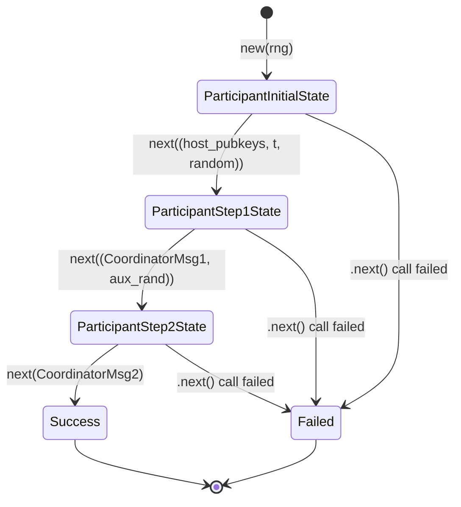
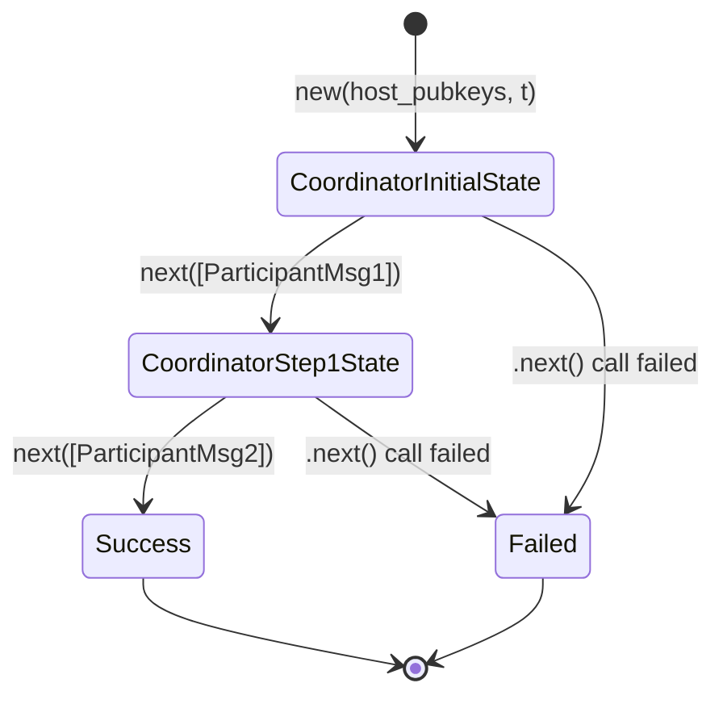
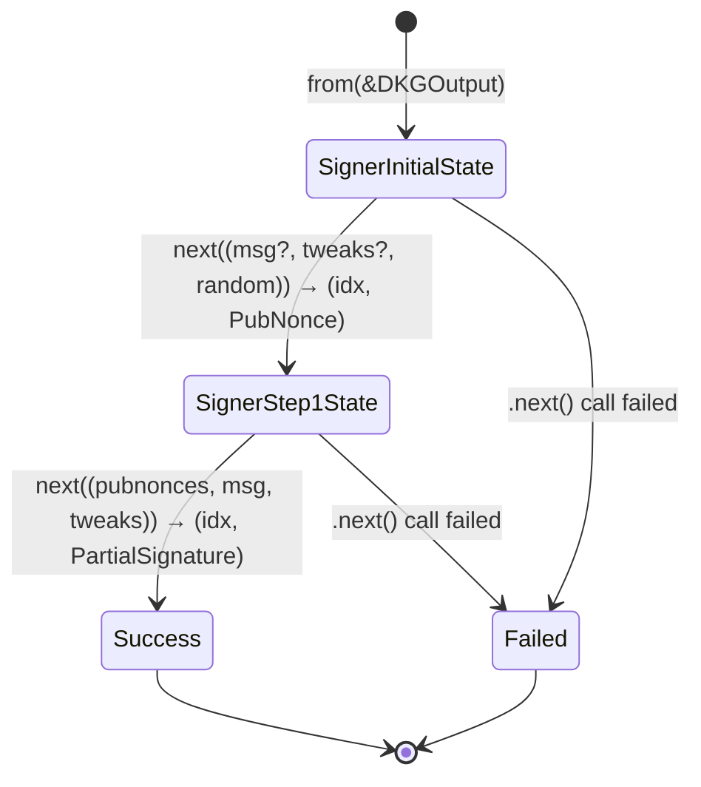
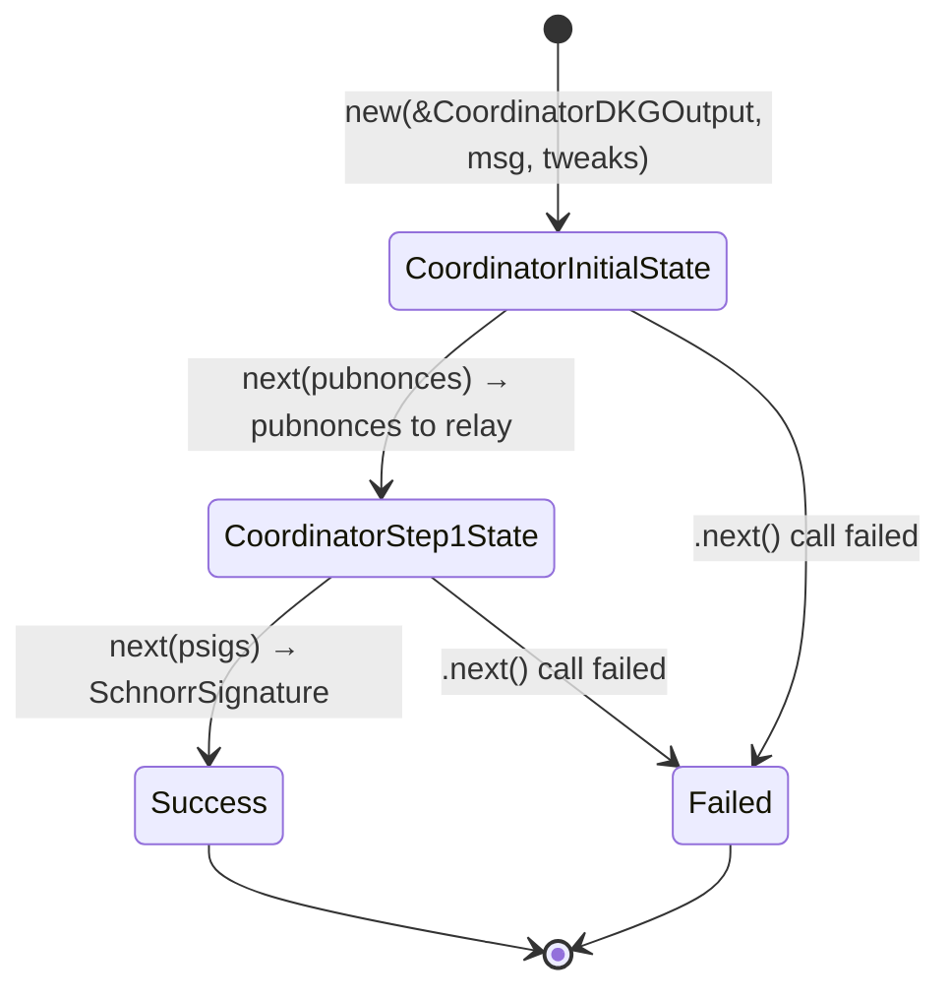

# ChillDKG

[](https://opensource.org/licenses/MIT)
[](https://github.com/olegfomenko/chilldkg/issues)
<a href="https://github.com/olegfomenko/chilldkg">

</a>

⚠️ __Please note - this crypto library has not been audited, so use it at your own risk.__

---

Experimental Rust implementation of the ChillDKG refers to the
[BlockstreamResearch BIP-FROST-DKG](https://github.com/BlockstreamResearch/bip-frost-dkg).

The crate is built around `k256` secp256k1 scalars and curve points. It exposes
typed participant and coordinator state machines, plus the lower-level crypto
building blocks used by the protocol.

⚠️ This repository is a work in progress.

- [x] The main participant and coordinator DKG flows.
- [x] Tests with reference test vectors.
- [x] Participant recovery using transcript and secret host key.
- [x] Coordinator recovery using transcript.
- [x] FROST signing ([BIP-FROST-signing](https://github.com/siv2r/bip-frost-signing), behind the `signing` feature).
- [ ] Deterministic FROST signing.
- [ ] Malicious behavior investigation.
- [ ] Messages serialization.
- [ ] Implementation audit.

## Implementation

- `src/dkg/party`: participant state machine.
- `src/dkg/coordinator`: coordinator state machine.
- `src/dkg/msg.rs`: typed protocol messages and recovery data.
- `src/dkg/errors.rs`: ChillDKG-style error names.
- `src/crypto`: tagged hashing, point helpers, encryption pads, proof of possession, CertEq helpers,
  Lagrange interpolation and key tweaking (the last two behind `signing`).
- `src/sign` (feature `signing`): FROST3 signing, laid out like `src/dkg`.
  - `src/sign/party`: signer state machine and nonce generation.
  - `src/sign/coordinator`: coordinator state machine, verification and aggregation helpers.
  - `src/sign/msg.rs`: public nonces and partial signatures.
  - `src/sign/errors.rs`: `SignError`.
- `tests`: unit tests and reference-vector integration tests.

The API models the protocol as consuming state transitions. Each call to `next`
takes the input for the current step, returns the next state, and returns the
message or output produced by that step.

High-level flow:

1. Each participant creates `ParticipantInitialState`.
2. The coordinator creates `CoordinatorInitialState` from all host public keys
   and threshold `t`.
3. Participants accept the coordinator-provided session parameters plus local
   randomness and produce `ParticipantMsg1`.
4. The coordinator aggregates all `ParticipantMsg1` values into `CoordinatorMsg1`.
5. Participants process `CoordinatorMsg1` and produce `ParticipantMsg2`.
6. The coordinator verifies all `ParticipantMsg2` values and produces
   `CoordinatorMsg2`, coordinator DKG output, and recovery data.
7. Participants verify `CoordinatorMsg2` and produce their final DKG outputs.

### Participant States

Each state transition for participant is implemented via

```rust
pub trait ParticipantState: Sized {
    type Message;
    type Next: ParticipantState;
    type Output;

    fn next(self, msg: Self::Message) -> Result<(Option<Self::Next>, Self::Output)>;
}
```


```mermaid
stateDiagram-v2
    [*] --> ParticipantInitialState: new(rng)
    ParticipantInitialState --> ParticipantStep1State: next((host_pubkeys, t, random))
    ParticipantInitialState --> Failed: .next() call failed
    ParticipantStep1State --> ParticipantStep2State: next((CoordinatorMsg1, aux_rand))
    ParticipantStep1State --> Failed: .next() call failed
    ParticipantStep2State --> Success: next(CoordinatorMsg2)
    ParticipantStep2State --> Failed: .next() call failed
    Success --> [*]
    Failed --> [*]
```

All transitions return `std::result::Result<T, ChillDkgError>`. Validation or protocol failures return
an error instead of advancing to the next state.

### Coordinator States

Each state transition for coordinator is implemented via

```rust
pub trait CoordinatorState: Sized {
    type Message;
    type Next: CoordinatorState;
    type Output;

    fn next(self, msg: Self::Message) -> Result<(Option<Self::Next>, Self::Output)>;
}
```


```mermaid
stateDiagram-v2
    [*] --> CoordinatorInitialState: new(host_pubkeys, t)
    CoordinatorInitialState --> CoordinatorStep1State: next([ParticipantMsg1])
    CoordinatorInitialState --> Failed: .next() call failed
    CoordinatorStep1State --> Success: next([ParticipantMsg2])
    CoordinatorStep1State --> Failed: .next() call failed
    Success --> [*]
    Failed --> [*]
```

All transitions return `std::result::Result<T, ChillDkgError>`. Validation or protocol failures return
an error instead of advancing to the next state.

## Example

All messages are defined in `chilldkg_rs::dkg::msg::*`. The outputs are
`chilldkg_rs::dkg::msg::CoordinatorDKGOutput` and `chilldkg_rs::dkg::msg::DKGOutput`. The recovery data is
`chilldkg_rs::dkg::msg::RecoveryData`. Errors are `chilldkg_rs::dkg::ChillDkgError`.

### State-machine level

The low-level state machine is exposed and can be used as well. Check tests in [lib.rs](./src/lib.rs).
You may need the following imports:

```rust
use chilldkg_rs::dkg::msg::*;
use chilldkg_rs::dkg::{
    CoordinatorInitialState, CoordinatorState, ParticipantInitialState, ParticipantState,
    ParticipantStep1State, ParticipantStep2State, Result,
};
```

Example for Participant:

```rust
fn main() -> Result<()> {
    // ...

    const N: usize = 5;
    const T: usize = 3;

    let mut rng = OsRng;

    // ...

    // 1. Prepare params 
    let party = ParticipantInitialState::new(&mut rng);
    // TODO: securely save p.s

    // 2. Execute step #1

    let random = [0u8; 32]; // TODO: generate good randomness 
    let (next, msg1) = party.next((host_pubkeys, T, random))?;
    let party = next.unwrap();

    // TODO: Share msg1 with Coordinator, receive cmsg1

    // 3. Execute step #2

    let aux = [0u8; 32];
    let (next, msg2) = party.next((cmsg1, aux))?;
    let party = next.unwrap();

    // TODO: Share msg2 with Coordinator, receive cmsg2

    // 4. Execute final check

    let (_, (participant_output, participant_recovery_data)) = party.next(cmsg2)?;

    // TODO: save somewhere participant_recovery_data and securely store private share in participant_output
}
```

In real use, `random` and `aux_rand` must be fresh 32-byte randomness values.
The all-zero arrays above are only to keep the example short.

Example for Coordinator:

```rust
fn main() -> Result<()> {
    // ...

    const N: usize = 5;
    const T: usize = 3;

    // ...

    // 1. Prepare params 
    let coordinator = CoordinatorInitialState::new(host_pubkeys.clone(), T)?;

    // TODO: collect pmsg1 from participants
    // 2. Execute step #1
    let (next, cmsg1) = coordinator.next(pmsg1s)?;
    let coordinator = next.unwrap();

    // TODO: share cmsg1 with all participants, collect pmsg2 from participants

    // 3. Execute step #2

    // Coordinator obtains DKG output immediately. 
    // However, we should wait upon successful execution of the last message by each participant.
    let (_, (cmsg2, coordinator_output, recovery_data)) = coordinator.next(pmsg2s)?;
    // TODO: share cmsg2 with all participants
}
```

### Crate-level

For engineers convenience we also introduce high-level SDK over state-machine. You may need the following imports:

```rust
use chilldkg_rs::dkg::Result;
use chilldkg_rs::dkg::{Coordinator, Participant};
```

Then, the code for participant is:

```rust
fn main() -> Result<()> {
    // ...

    const N: usize = 5;
    const T: usize = 3;

    // ...

    let (host_seckey, mut party) = Participant::new(&mut rng);
    // TODO: Securely save host_seckey

    let random = [0u8; 32]; // TODO: generate good randomness
    let msg1 = party.step1((host_keys, T, random))?;
    // TODO: send msg1, receive msg1_resp from coordinator

    let aux = [0u8; 32]; // TODO: generate good randomness
    let msg2 = party.step2((msg1_resp, aux))?;
    // TODO: send msg2, receive msg2_resp from coordinator

    let (output, recovery) = party.finalize(msg2_resp)?;
    // Output contains your secure share, while recover contains public transcript and signatures
    // TODO: save somewhere recovery and securely store private share in output
}
```

The core for coordinator is as follows:

```rust
fn main() -> Result<()> {
    // ...

    const N: usize = 5;
    const T: usize = 3;

    // ...

    let mut coordinator = Coordinator::new(host_keys, T)?;

    // TODO: receive messages from participants and put into the msg1 list
    let msg1_resp = coordinator.step1(msg1)?;
    // TODO: share msg1_resp with all participants

    // TODO: receive messages from participants and put into the msg2 list
    // Coordinator obtains DKG output immediately. 
    // However, we should wait upon successful execution of the last message by each participant.
    let (msg2_resp, output, _) = coordinator.step2(msg2)?;
    // TODO: send msg2_resp to all participants
}
```

To recover DKG results on the participants side, you have to provide participant's host secret key and recovery data as
follows:

```rust
use chilldkg_rs::dkg::{Coordinator, Participant};

fn main() -> Result<()> {
    // ...
    
    // Participant's output
    let p_output_recovered = Participant::recover(&host_seckey, &recovery_data)?;

    // ...
    
    // Coordinator's output
    let c_output_recovered = Coordinator::recover(&recovery_data)?;
}
```

## Signing

FROST signing over a ChillDKG output lives behind the `signing` feature, which is enabled
by default. Opt out for a DKG-only build:

```toml
[dependencies]
chilldkg-rs = { version = "0.4", default-features = false }
```

It follows the [BIP-FROST-signing](https://github.com/siv2r/bip-frost-signing) reference
(FROST3): any `t` of the `n` participants produce a signature that verifies as a plain
BIP340 signature under the threshold public key. Participant ids are the ChillDKG indices,
and the subset that signs is simply the set of ids that contribute a nonce.

Like the DKG, signing is modelled as consuming state transitions: each `next` call
takes the input for the current round, returns the next state and the message or output
of that round. A signer may generate its nonce before the message and the tweaks are
known (they are passed as `None` at round 1 and are then required at round 2); when they
are known up front, passing them at round 1 binds the nonce to them and round 2 refuses
anything else. The coordinator knows both when it starts a session. You may need the
following imports:

```rust
use chilldkg_rs::dkg::msg::{CoordinatorDKGOutput, DKGOutput};
use chilldkg_rs::sign::errors::Result;
use chilldkg_rs::sign::{
    CoordinatorInitialState, CoordinatorState, SignerInitialState, SignerState, Tweak,
};
```


```mermaid
stateDiagram-v2
    [*] --> SignerInitialState: from(&DKGOutput)
    SignerInitialState --> SignerStep1State: next((msg?, tweaks?, random)) → (idx, PubNonce)
    SignerInitialState --> Failed: .next() call failed
    SignerStep1State --> Success: next((pubnonces, msg, tweaks)) → (idx, PartialSignature)
    SignerStep1State --> Failed: .next() call failed
    Success --> [*]
    Failed --> [*]
```


```mermaid
stateDiagram-v2
    [*] --> CoordinatorInitialState: new(&CoordinatorDKGOutput, msg, tweaks)
    CoordinatorInitialState --> CoordinatorStep1State: next(pubnonces) → pubnonces to relay
    CoordinatorInitialState --> Failed: .next() call failed
    CoordinatorStep1State --> Success: next(psigs) → SchnorrSignature
    CoordinatorStep1State --> Failed: .next() call failed
    Success --> [*]
    Failed --> [*]
```

### Participant

```rust
fn main() -> Result<()> {
    // ...

    // One state per signing session, built from the DKG output.
    let signer = SignerInitialState::from(&output);

    // Round 1: derive a nonce pair bound to the share, the (tweaked) key and
    // the message; `random` must be 32 fresh random bytes. Pass `None` for the
    // message and/or tweaks to generate the nonce before they are known.
    let (next, pubnonce) = signer.next((Some(msg.to_vec()), Some(tweaks.clone()), random))?;
    let signer = next.unwrap();
    // TODO: send `pubnonce` (already paired with this participant's id) to the coordinator

    // TODO: receive the (id, pubnonce) list of all signers from the coordinator

    // Round 2: produce the partial signature. The state (and with it the
    // secret nonce) is consumed here, so a nonce can never be used twice.
    // The message and tweaks must match the ones given at round 1, if any.
    let (_, psig) = signer.next((pubnonces, msg.to_vec(), tweaks.clone()))?;
    // TODO: send `psig` (already paired with this participant's id) to the coordinator
}
```

### Coordinator

```rust
fn main() -> Result<()> {
    // ...

    let coordinator =
        CoordinatorInitialState::new(&coordinator_output, msg.to_vec(), tweaks.clone())?;

    // TODO: select at least t signers and collect their (id, pubnonce)

    // Round 1: validates the signing subset and its nonces before relaying.
    let (next, relayed) = coordinator.next(pubnonces)?;
    let coordinator = next.unwrap();
    // TODO: send `relayed` to every signer, collect their (id, psig)

    // Round 2: verifies every partial signature (a bad one is reported as
    // InvalidContribution { participant: id, .. }), combines them and checks
    // the result under the tweaked threshold key.
    let (_, sig) = coordinator.next(psigs)?;
}
```

Anyone holding only the public key material can use the stateless helpers:
`sign::verify` checks a final signature under the (tweaked) threshold key and
`sign::signing_pubkey` returns that key for external BIP340 verifiers; `sign::validate_signers`
and `sign::partial_verify` are the lower-level building blocks the state machines use.

### Tweaks

A session may sign under a tweaked key, e.g. a BIP32 child (plain tweak) or a BIP341
Taproot output key (x-only tweak). Tweaks are applied in order and every party must pass
the same list:

```rust
let tweaks = [
    Tweak::plain(bip32_tweak),   // 32 bytes, applied as `Q' = Q + tweak * G`
    Tweak::xonly(taproot_tweak), // 32 bytes, applied to the even-y form of `Q`
];

let (next, pubnonce) =
    SignerInitialState::from(&output).next((Some(msg.to_vec()), Some(tweaks.clone()), random))?;
let coordinator = CoordinatorInitialState::new(&coordinator_output, msg.to_vec(), tweaks.clone())?;

// The key the signature verifies under, for external BIP340 verifiers.
let tweaked_pubkey = sign::signing_pubkey(&coordinator_output.threshold_pubkey, &tweaks)?;
sign::verify(&coordinator_output.threshold_pubkey, sig, msg, &tweaks)?;
```

Note that a ChillDKG threshold key already commits to an unspendable Taproot script path
(`TapTweak` with no script), as BIP445 requires of key generation, so no extra tweak is
needed to spend it as a key-path-only Taproot output.

## Tests

Run all tests:

```bash
cargo test
```

The `sign_*` targets require the `signing` feature (on by default); `cargo test --no-default-features`
runs the DKG tests only.

Current vector coverage:

- `participant_step1_vectors`: reference cases `1, 3, 5, 6`.
- `participant_step2_vectors`: reference cases `1, 3, 4, 5, 6, 7`.
- `participant_finalize_vectors`: reference cases `1, 2, 3`.
- `coordinator_step1_vectors`: reference cases `1, 2, 4, 5`.
- `coordinator_finalize_vectors`: reference cases `1, 2, 3`.
- `recover_vectors`: reference cases `1, 2, 3, 4, 5, 6, 7, 8, 9, 11`.
- `sign_nonce_vectors`, `sign_vectors`: BIP-FROST-signing `nonce_gen`, `nonce_agg`, `tweak` and
  `sign_verify` vectors (encoding-only error cases omitted).
- `sign_coordinator_vectors`: the signing coordinator's two rounds, driven by the `sign_verify`
  error and verify-fail vectors and the `sig_agg` valid vectors. The `sig_agg` vectors are also run
  against the aggregation step alone in a unit test next to it.

## Differences From The Reference Implementation

This crate follows the protocol logic of the Python reference implementation in
the core successful participant and coordinator DKG flow: VSS coefficient
derivation, EncPedPop encryption pads, PoP verification, CertEq signatures,
Taproot tweaking, public share calculation, and final certificate verification
are intended to match the reference and are checked with reference vectors.

The remaining differences are API, serialization, recovery, and fault-handling
differences:

- The reference public API is byte-oriented, while ours is currently datastructs-oriented.
- The reference messages serialize some group elements with an explicit
  point-at-infinity encoding. This crate currently avoids custom serializers and
  mostly works with typed points plus ordinary compressed SEC1 encoding.
- The reference includes optional malicious-behavior investigation
  (`participant_investigate` and `coordinator_investigate`) for invalid encrypted
  shares. This crate raises the corresponding unknown-fault error during
  participant step 2, but does not carry the investigation data or implement the
  investigation protocol.
- Recovery is split into participant and coordinator APIs in this crate.
- Reference-vector files are adapted only where needed to reach the typed Rust
  API.
- Recovery validation order is not identical. This affects error classification
  for malformed recovery data but not the DKG output accepted on a successful
  recovery.
- Recovery transcript parsing is stricter for public nonces. This may change
  which error is returned for malformed recovery bytes.

## Development Notes

- Uppercase local variable names such as `P_i` and `C_k` denote curve points.
- Lowercase scalar names such as `s`, `r`, and `tweak` denote scalars or ordinary values.
- The implementation deliberately avoids custom serializers for `k256` types for now.
